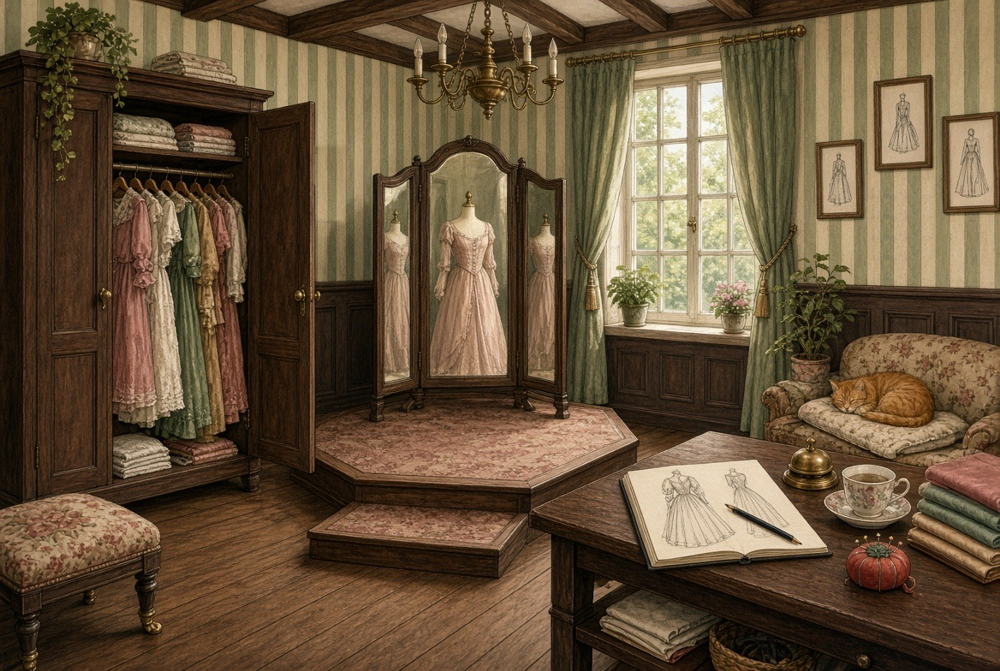

# Dressmaker Atelier 👗

Try the dresses you design in the video game **Dressmaker** on real people!

You pick a dress from the game and a photo of a person (a "model"). The app asks
**Grok** (an AI made by xAI) to make a new picture of that person wearing that dress.
It all happens in a cozy painted dressmaker's room:



---

## ⚠️ Read this first (important!)

- **It costs real money.** Every picture Grok makes costs about **8 cents** (US$0.08).
  You need an xAI account with credit on it. **Ask a parent or guardian to set that up.**
  It needs a payment card, and xAI has its own age rules.
- **Your Grok key is like a password that spends money.** Never show it to anyone,
  never post it online, and never put it in the code. It only goes in a file called `.env`
  (see step 4). That file is never uploaded.
- **Only use photos of people who said yes.** Ask before you use anyone's picture,
  and ask again before you share what you made.
- **Photos are sent to xAI** to make the new pictures. Everything else stays on your computer.

---

## What you need

- A computer with **Windows, Mac or Linux**
- **Python 3.10 or newer**, a free program from [python.org](https://www.python.org/downloads/).
  On Windows, tick **"Add python.exe to PATH"** when you install it.
- An **xAI API key** (your "Grok key"). See step 3.
- Some **dress pictures** from Dressmaker, and some **photos of people**

---

## Install it (one time)

### 1. Get the code

Either click the green **Code** button on this page, then **Download ZIP**, and unzip it.
Or, if you know git:

```
git clone https://github.com/mvg73/atelier.git
```

You now have a folder called `atelier`. Everything below happens inside it.

### 2. Open a terminal in the `atelier` folder

- **Windows:** open the folder, click the address bar at the top, type `powershell` and press Enter.
- **Mac:** right-click the folder and choose **New Terminal at Folder**.
- **Linux:** right-click inside the folder and choose **Open in Terminal**.

### 3. Get your Grok key (with a grown-up)

1. Go to [console.x.ai](https://console.x.ai) and sign in (or make an account).
2. Add some credit to the account (a few dollars is plenty to start).
3. Open **API Keys** and create a new key. It starts with `xai-`.
4. Copy it. You only see it once, so keep it somewhere safe.

### 4. Put the key in a `.env` file

1. In the `atelier` folder, find the file **`.env.example`**.
2. Make a copy of it and name the copy exactly **`.env`** (a dot, then `env`, and nothing else).
3. Open `.env` in a text editor and replace `xai-paste-your-key-here` with your real key:

```
XAI_API_KEY=xai-abc123...your-real-key...
```

4. Save it.

> **Windows tip:** Notepad likes to secretly name it `.env.txt`. In the save box, set
> "Save as type" to **All files** and type the name as `.env`.

### 5. Install what the app needs and start it

**Mac or Linux:**

```
./run.sh
```

That's all. The first time, it sets everything up (it takes a minute), then opens the
app in your web browser at **http://127.0.0.1:5000/atelier**.

**Windows** (in PowerShell, one line at a time):

```
py -m venv .venv
.venv\Scripts\pip install -r requirements.txt
.venv\Scripts\python app.py
```

Then open **http://127.0.0.1:5000/atelier** in your web browser.

**Next time**, you only need the last line (`./run.sh` on Mac/Linux, or
`.venv\Scripts\python app.py` on Windows). To stop the app, click the terminal and
press **Ctrl + C**.

---

## Set up your dresses and models

The app needs two folders:

| Folder | What goes in it |
|---|---|
| **Dresses** | Pictures of your dresses from Dressmaker (PNG files, like `Dressmaker_Dress_20261004_155249.png`) |
| **Models** | Photos of people: one person per photo, standing, full body, facing the camera |

**Models:** put your photos in the **`people`** folder inside `atelier`. The app makes
that folder the first time it starts. Photos in it are **never uploaded** to GitHub.

**Dresses:** the first time, click **⚙ Settings** at the top-left of the room, then
**Browse…** next to **Dresses folder**, and pick the folder with your dress pictures.
It tells you how many dresses it found. Press **Save**. (You can change the models
folder the same way.)

If the cat says **"No Grok key yet!"**, go back to step 4.

> **Tip:** The best photos show the whole person from head to toe, in front of a plain wall.

---

## How to use it

Everything in the room that you can click **glows** when your mouse is over it.

1. **The wardrobe** 🚪: click it and pick one or more dresses. Click a dress's paper tag to give it a name.
2. **The tablet** 📱 on the desk: click it and tick the models you want. A red **!** means something
   needs doing there, like choosing a model.
3. **The logbook** 📖 on the desk (or ring the **bell** 🛎️): the last page, **"The next fittings"**,
   shows every dress × model you picked.
   - Want something different? Write it in the box on that card, like
     *"make it a mini dress and give her purple toe nail polish."*
   - Press **Try on**. The cat 🐈 tells you exactly what was sent.
4. **Wait a moment.** The teacup steams ☕ while Grok sews. When it's done, your new picture appears in
   the **mirror** 🪞.

### Other things to try

- **The mirror:** click it to look closer. You can zoom, compare with the original dress, and slide
  between the new and an older version.
- **The pincushion** 📍: fix a picture ("the sleeves should be shorter"), redo it, make a new take,
  copy it, undo, or throw it away.
- **The picture frames** 🖼️: hang your favourite looks on the wall.
- **The basket** 🧺 under the desk: deleted pictures wait here, and you can pull them back out.
- **The bill** under the teacup shows how much you've spent today.
- **The arrow keys** ← → flip through your pictures.

There's also a simpler **plain view** at http://127.0.0.1:5000. You can turn it off in **⚙ Settings**.

---

## Where your pictures are saved

New pictures go into folders inside `atelier` named by date, like `Render10062026`
(that's October 6, 2026). Older versions are kept in `_previous`, and deleted ones in
`_deleted`, so nothing gets lost by accident. None of these are uploaded to GitHub.

---

## Something not working?

| Problem | Try this |
|---|---|
| "XAI_API_KEY is not set" | Your `.env` file is missing, misnamed (`.env.txt`?), or not in the `atelier` folder. Fix it, then stop the app (Ctrl + C) and start it again. |
| "xAI API 401" or "403" | The key is wrong or was deleted. Make a new one at console.x.ai. |
| "xAI API 429" or a money error | You're out of credit, or making too many at once. Add credit, or wait a minute. |
| The wardrobe or tablet is empty | Open **⚙ Settings** and check the folders. Dresses must be **PNG** files. |
| `python` or `py` "not found" | Install Python from python.org (on Windows, tick "Add python.exe to PATH"). |
| "Address already in use" | The app is already running in another terminal. Use that one, or close it first. |
| The picture came out wrong | Use the **pincushion** to Fix it with a short note, or Redo it. AI isn't perfect! |

---

## For grown-ups and tinkerers

- It's a small [Flask](https://flask.palletsprojects.com/) app: `app.py`, plus two pages in `templates/`.
- It only listens on your own computer (`127.0.0.1`). Please keep it that way. Don't put it on the internet.
- Optional `.env` settings:
  - `XAI_MANAGEMENT_KEY` and `XAI_TEAM_ID` show your prepaid xAI balance in the app
  - `XAI_IMAGE_MODEL` chooses the image model (the default is `grok-imagine-image-2.0`)
- Your names, notes, framed looks and settings are saved in `library.json` and `settings.json`. Both stay on your computer.

---

## License

Copyright © 2026 mvg73. Released under the [MIT License](LICENSE).

You're free to use, copy, change and share this app, as long as you keep the copyright
notice and the license with it. It comes with no warranty.

The room artwork (`static/atelier/room.jpg`) is part of this project and covered by the same license.

Have fun designing! ✨
